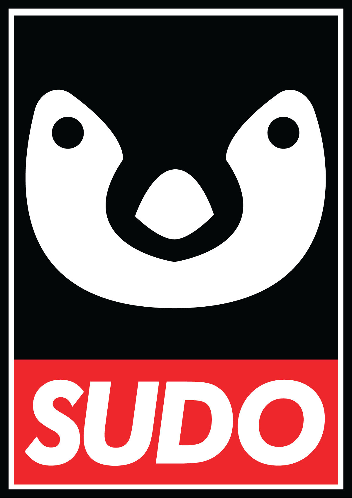
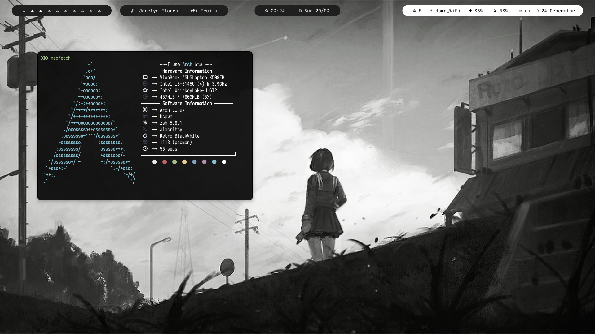
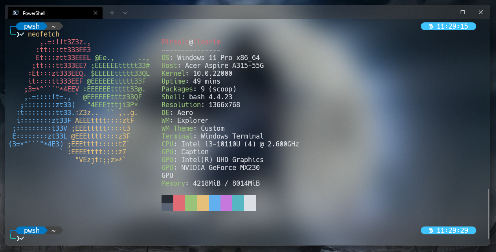
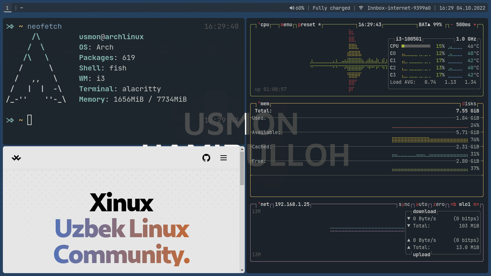
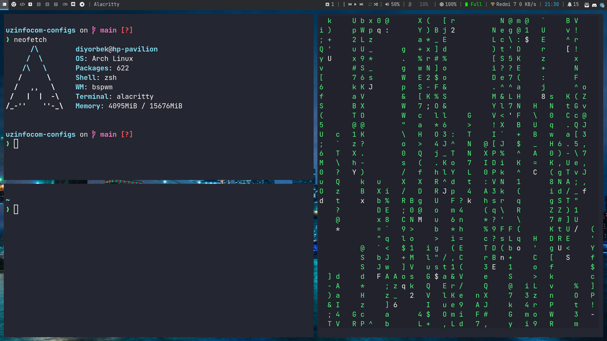
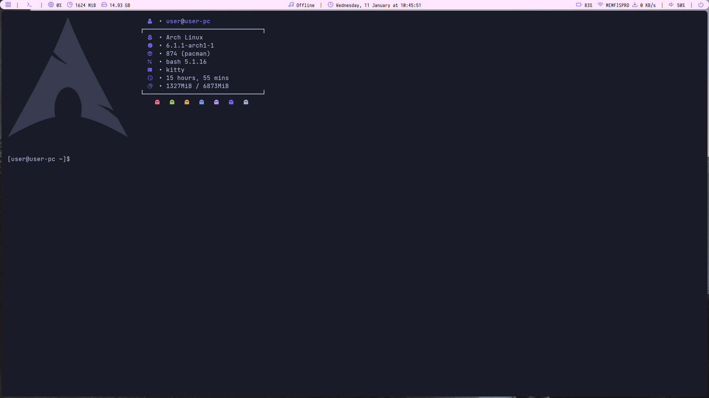

<h1 align="center">Configlaringiz bilan bo'lishing!</h1>

**Agar o'zingizda boshqalarnikidan ajralib turadigan linux parametrlari borligini his qilsangiz, hammasi bilan bizga ko'rsating va ulashing ularni. Ushbu repozitoriya saqlash maqsadida ham xizmat qiladi.**

## Qoidalar

1. Konfiguratsiyalaringiz ishlab turgan holatida bitta screenshot taqdim eting.
2. Hamma konfiguratsiyalarni o'zingizning GitHub laqabingiz nomli papkani ichida shu repozitoriyaga ulashing
3. Agar boshqacha shrift va o'lchamlar ishlatsangiz, ularni ham ulashing

## Konfiguratsiyalar

<h3 align="center">UwUssimo</h3>

- **Operatsion Tizim:** MacOS Monterey 12.4 `ARM64`
- **Terminal:** iTerm2
- **Shrift:** SF (San Francisco by Apple) Mono Nerd Font (12pt)
- **Ranglar Sxemasi:** [`Custom Material by UwU`](https://github.com/uwussimo/dots/tree/cbb9c890ebf1f31fba60ee6eeec121dccb44e0df/data/rust/term)

<h3 align="center">Genemator</h3>

- **Operatsion Tizim:** MacOS Big Sur `ARM64`
- **Terminal:** Apple Terminal
- **Shrift:** JetBrains Mono Nerd Font (16pt) + Knack Regular Nerd Font (15pt).
- **Ranglar Sxemasi:** [`Material Design`](https://github.com/MartinSeeler/iterm2-material-design)

- **Operatsion Tizim:** [`Arch Linux 'x86_64'`](https://archlinux.org/)
- **Terminal:** [`alacritty`](https://github.com/alacritty/alacritty)
- **Bar:** [`polybar`](https://github.com/polybar/polybar)
- **Kompozitor:** [`picom`](https://github.com/yshui/picom)
- **Screenshot vositasi:** [`scrot`](https://github.com/dreamer/scrot)
- **Hotkey daemon:** [`sxhkd`](https://github.com/baskerville/sxhkd)
- **Shrift:** Iosevka Nerd Font Complete (12pt) + Fantasque Sans Mono Regular (12pt)
- **Ranglar Sxemasi:** [`Retro BlackWhite`] (Custom)

<h3 align="center"><a href="https://github.com/sad1go0" target="_blank">SaDi</a></h3>

- **OS:** Arch Linux
- **Shell:** zsh (oh my zsh)
- **WM:** bspwm
- **Terminal Font:** JetBrainsMono Nerd Font Mono
- **Terminal Theme:** powerlevel10k

<h3 align="center"><b>ilosrim</b></h3>

- **Operatsion Tizim:** Windows 11 Pro 86_64
- **Terminal:** Windows Terminal
- **Shrift:** Hack Regular Nerd Font Complete Mono Windows Compatible
- **Ranglar Sxemasi:** [`Powerline`](https://github.com/b-ryan/powerline-shell)

<h3 align="center"><a href="https://github.com/UsmonHamidulloh" target="_blank">Usmon Hamidulloh</a></h3>

- **OS:** Arch Linux
- **Shell:** fish
- **WM:** i3
- **Terminal:** Alacritty
- **Shirft:** JetbrainsMono Nerd Font + JetbrainsMono

<h3 align="center"><a href="https://github.com/YoshlikMedia" target="_blank"><code>Yoshlik Media</code></a></h3>

- **Operatsion Tizim:** MacOS Monterey `ARM64`
- **Terminal:** Apple Terminal + ([`Iterm2`](https://iterm2.com/)) + ([`oh my zsh`](https://ohmyz.sh/))
- **Shrift:** [`JetBrains Mono`](https://www.jetbrains.com/lp/mono/)
- **Ranglar Sxemasi:** Iterm2 Default + Color preset
- **Avto yakunlash:** [`fig`](https://fig.io/)

<h3 align="center"><a href="https://github.com/DiyorbekOlimov" target="_blank">Diyorbek Olimov</a></h3>

- **OS:** [`Arch Linux`](https://archlinux.org/)
- **Terminal:** [`Alacritty`](https://github.com/alacritty/alacritty) + [`zsh`](https://www.zsh.org/) + [`starship`](https://starship.rs/)
- **WM:** [`bspwm`](https://github.com/baskerville/bspwm)
- **Shirft:** [`JetBrainsMono Nerd Font`](https://github.com/ryanoasis/nerd-fonts/tree/master/patched-fonts/JetBrainsMono)

<h3 align="center"><a href="https://github.com/abdurakhman-uz" target="_blank">Abduazimov</a></h3>

- **OS:** [`Arch Linux`](https://archlinux.org/)
- **Terminal:** [`Alacritty`](https://github.com/alacritty/alacritty)
- **WM:** [`i3`](https://github.com/baskerville/bspwm)
- **Fonts:** [Open Sans](https://fonts.google.com/specimen/Open+Sans#standard-styles) + [Roboto Mono](https://fonts.google.com/specimen/Roboto+Mono#standard-styles) 
- **Icons** [Papirus dark](https://github.com/PapirusDevelopmentTeam/papirus-icon-theme) + [Feather](https://github.com/AT-UI/feather-font/blob/master/src/fonts/feather.ttf)

<h3 align="center">Bu yerda sizning konfiglaringiz bo'lishi mumkin...</h3>
