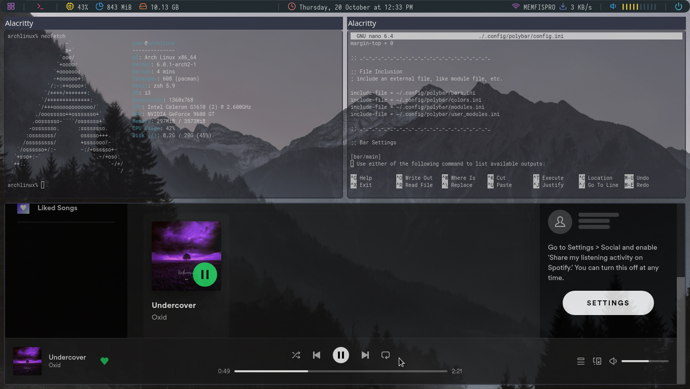

### Used Resources
- **OS:** [Arch Linux](https://archlinux.org)
- **WM:** [i3-gaps](https://github.com/Airblader/i3)
- **Bar:** [polybar](https://github.com/polybar/polybar)
- **Terminal:** [alacritty](https://github.com/alacritty/alacritty)
- **Application Launcher:** [rofi](https://github.com/davatorium/rofi)
- **Compositor:** [picom](https://github.com/yshui/picom)
- **Notification Deamon:** [dunst](https://github.com/dunst-project/dunst)
- **Monitor of Resources:** [btop](https://github.com/aristocratos/btop)    
- **Icons:** [Papirus dark](https://github.com/PapirusDevelopmentTeam/papirus-icon-theme)  

	
### Used Fonts
	
**Icons:** [Feather](https://github.com/AT-UI/feather-font/blob/master/src/fonts/feather.ttf)    
**Interface Font:** [Open Sans](https://fonts.google.com/specimen/Open+Sans#standard-styles)    
**Monospace Font:** [Roboto Mono](https://fonts.google.com/specimen/Roboto+Mono#standard-styles)    
**Polybar Font:** [Iosevka Nerd Font](https://github.com/ryanoasis/nerd-fonts/tree/master/patched-fonts/Iosevka)


### Use
Download Config files from GitHub:
```
git clone https://github.com/abduazimov-git/dotfiles.git
```
Enter the folder we downloaded:
```
cd dotfiles/
```
copy Config files to the desired location:
```
cp -r i3/ $HOME/.config/
cp -r polybar/ $HOME/.config/
cp -r rofi/ $HOME/.config/
cp -r dunst/ $HOME/.config/
cp -r alacritty/ $HOME/.config/
cp -r btop/ $HOME/.config/
cp -r neofetch/ $HOME/.config/
cp -r wallpapers/ $HOME/.config/
cp picom.conf $HOME/.config/
```

### Thanks To
- [Diyorbek](https://github.com/DiyorbekOlimov) - For BTOP configs